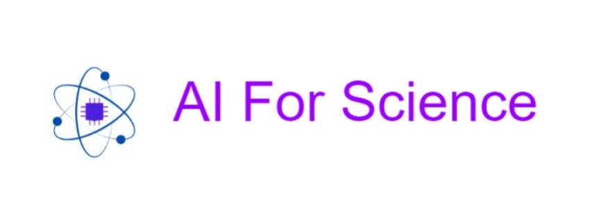

# **AI4Science**

## 🔔 Latest Updates

* [2023/09/23] Repository created and hosted on <u>[GitHub](https://github.com/astitvac/AI4Science)</u>

<!-- This is a comment in Markdown -->
Welcome to the **AI4Science** repository! This repository is designed to be a collaborative sandbox for exploring AI4Science containers.The goal is to collect and design **Repeatable Research containers** that combine **Data** **Software** **Compute** into portable, secure and self contained AI4Science workflows.   

## Using LLMs for Peer Review

* [LLM-scientific-feedback](https://github.com/weixin-liang/llm-scientific-feedback) 

Can LLMs be used as substitutes for peer review in scientific publishing? This repository contains code for training LLMs on scientific papers and evaluating their performance on peer review tasks.

### What is an RRC?

An RRC is a container that contains all of the code, data, and documentation needed to reproduce a scientific result on any kind of computing infrastructure. RRCs are designed to be self-contained, portable, and easy to use. They can be used to reproduce a result, verify a result, or build upon a result.

For a detailed explanation of RRCs, please see the following article
<u>[AI4Science Newsletter - Edition2](https://www.linkedin.com/newsletters/7109641758220697602/?displayConfirmation=true)</u>

## Table of Contents

* [Repeatable Research Containers](#)
* [Open Source respositories](#)
* [Datasets](#datasets)
>
* [Research Papers](#)
* 
>
* [Contributing](#contributing)
* [License](#license)

## Resources for AI4Science

If you're new to AI or scientific research, we recommend starting with the resources and tutorials listed in this README. These will provide you with a solid foundation for using AI in your research.<u>This resources list is not exhaustive and will be updated reularly through contributions from the community.</U>

### Tutorials

Here are some resources that can help you learn more about AI and scientific research:

#### [Jupyter Notebook Tips and Tricks](https://github.com/jbwhit/jupyter-tips-and-tricks)
1. **Original Authors**: Maintained by Jonathan Whitmore
2. **AI4Science Usage**: This repository offers a collection of Jupyter Notebook tips and tricks aimed at pragmatic usage. While not specifically designed for scientific research, the tips can enhance the efficiency of data analysis, visualization, and code organization in scientific workflows.
3. **Deployment/Usage Guidelines**: The repository provides a detailed README with installation steps for setting up a conda environment. It also includes troubleshooting tips and extra ideas for advanced users. [Installation Steps](https://github.com/jbwhit/jupyter-tips-and-tricks#assuming-you-are-on-a-mac)

*[AI for Science Whitepaper](https://www.microsoft.com/en-us/research/publication/ai-for-science-whitepaper/)

* [AI for Science Summit](https://www.microsoft.com/en-us/research/event/ai-for-science-summit/)
* [AI for Science Community](https://www.microsoft.com/en-us/ai/ai-for-science)

### Open source repositories

#### [arXivScraper: Retrieve Records from arXiv](https://github.com/Mahdisadjadi/arxivscraper)
1. **Original Authors**: Developed by Mahdi Sadjadi
2. **AI4Science Usage**: arXivScraper is a Python library designed to scrape records from arXiv categories within a specified date range. It can be particularly useful for researchers in AI for Science to automate the collection of relevant papers, thereby aiding in literature review and keeping up-to-date with the latest research.
3. **Deployment/Usage Guidelines**: The library can be installed via pip or by downloading the source code. It allows for custom filters to narrow down the search. [Installation Steps](https://github.com/Mahdisadjadi/arxivscraper#install)
4. **License**: This project is licensed under the [MIT License](https://github.com/Mahdisadjadi/arxivscraper/blob/master/LICENSE).

#### [S2ORC: The Semantic Scholar Open Research Corpus](https://github.com/allenai/s2orc)
1. **Original Authors**: Developed by Kyle Lo and Lucy Lu Wang at the Allen Institute for AI. Maintained by the API team at Semantic Scholar.
2. **AI4Science Usage**: S2ORC is a general-purpose corpus for NLP and text mining over scientific papers. It can be invaluable for AI in Science as it provides a rich dataset for training models on scientific literature, aiding in tasks like literature review automation, citation analysis, and knowledge extraction.
3. **Deployment/Usage Guidelines**: The dataset is available through the [Semantic Scholar Public API](https://www.semanticscholar.org/product/api) as a "Bulk Dataset". For more details on how to download and use it, refer to the [Download Instructions](https://github.com/allenai/s2orc#download-instructions).
4. **License**: Released under the [ODC-By 1.0 License](https://opendatacommons.org/licenses/by/1-0/). By using S2ORC, you agree to the terms in the license.

Here are some repositories that contain code related to AI and scientific research:

* [Microsoft Research AI](https://github.com/Microsoft/ai)
* [Google Research](https://github.com/google-research)
* [OpenAI](https://github.com/openai)

### Datasets

* [Data Commons](https://datacommons.org/)

Here are some datasets that can be used for AI and scientific research:

* [Kaggle Datasets](https://www.kaggle.com/datasets)
* [UCI Machine Learning Repository](https://archive.ics.uci.edu/ml/index.php)
* [Google Dataset Search](https://datasetsearch.research.google.com/)

### Models

Here are some pre-trained models that can be used for AI and scientific research:

* [TensorFlow Hub](https://tfhub.dev/)
* [PyTorch Hub](https://pytorch.org/hub/)

## How to build an RRC

I would start by using <u>[Jupyter](#jupyter-hub-tips-and-tricks)</u> to create a notebook that contains all of the code, data, and documentation needed to reproduce a result. This notebook can then be converted into an RRC using the [RRC Builder](

## Contributing

We welcome contributions from the community! If you have a resource, repository, dataset, tutorial, or model that you would like to add to this repository, please see our [contributing guidelines](CONTRIBUTING.md) for more information.

## License

This repository is licensed under the [MIT License](LICENSE).

### [Biological Structure and Function Emerge from Scaling Unsupervised Learning to 250 Million Protein Sequences](https://myaidrive.com/ZDhXiAHUcqD7yVbo/rives-et-al-.pdf)

1. **Original Authors / Resource Creators**: Authors from OpenAI and other institutions.
2. **AI4Science Usage**: 
    - This paper demonstrates the power of unsupervised learning in understanding biological sequences, specifically proteins. 
    - The methodologies and findings can be adapted for various scientific use-cases that require understanding complex biological data, such as drug discovery or genetic research.
3. **Deployment/Usage Guidelines**: 
    - The paper is academic and theoretical, so direct deployment is not applicable. 
    - However, researchers can study the methodologies used for potential application in similar AI for Science projects.
    - The paper is open access and distributed under the Creative Commons Attribution-NonCommercial-NoDerivatives License 4.0 (CC BY-NC-ND).

### [OpenMM: A High Performance Molecular Dynamics Library](https://github.com/openmm/openmm)

1. **Original Authors / Resource Creators**: Developed and maintained by the OpenMM team.
2. **AI4Science Usage**: 
    - OpenMM is a toolkit designed for molecular simulations, particularly optimized for high-performance computing on GPUs.
    - It can be invaluable for scientific research in fields like biochemistry, pharmacology, and materials science where molecular dynamics simulations are crucial.
    - Its flexibility allows for custom forces and integrators, making it adaptable for a variety of scientific use-cases.
3. **Deployment/Usage Guidelines**: 
    - OpenMM can be used as a stand-alone application or as a library integrated into your own code.
    - It is written primarily in C++ and supports Python bindings.
    - The project is open-source and the license details can be found in the repository.

### [GROMACS: Molecular Simulation Toolkit](https://github.com/gromacs/gromacs)

1. **Original Authors / Resource Creators**: Developed and maintained by the GROMACS team.
2. **AI4Science Usage**: 
    - GROMACS is a molecular simulation toolkit primarily used for simulating proteins, lipids, and nucleic acids.
    - It can be applied in various scientific domains like biochemistry, biophysics, and materials science for molecular dynamics simulations.
    - The toolkit is highly optimized for performance and can be used for large-scale simulations, making it suitable for AI-driven scientific research.
3. **Deployment/Usage Guidelines**: 
    - GROMACS is written in C++ and supports Python bindings.
    - It uses the CMake build system for installation. Detailed installation guidelines can be found [here](http://manual.gromacs.org/documentation/current/install-guide/index.html).
    - The project is licensed under LGPL-2.1.

### [Better Scientific Software Tutorial](https://github.com/bssw-tutorial)

1. **Original Authors / Resource Creators**: Developed and maintained by the BSSW team as part of the IDEAS Productivity Project.
2. **AI4Science Usage**: 
    - The BSSW Tutorial provides materials about developer productivity and software sustainability in scientific research software.
    - It covers a range of topics that are essential for researchers who are developing or using software for scientific computations, making it a valuable resource for AI in Science.
    - The tutorial modules include presentations and hands-on activities, making it a comprehensive guide.
3. **Deployment/Usage Guidelines**: 
    - The tutorials are primarily in HTML and C, with some modules in Fortran and Jupyter Notebook.
    - The repository is organized into different modules, each focusing on a specific aspect of scientific software development.
    - No specific license information is provided in the repository.

### [PeptideBERT: Transformer Based Language Model for Peptide Property Prediction](https://github.com/ChakradharG/PeptideBERT)

1. **Original Authors / Resource Creators**: Developed and maintained by Chakradhar Guntuboina and adritad.
2. **AI4Science Usage**: 
    - PeptideBERT is designed for peptide property prediction using Transformer-based language models.
    - It can be useful in bioinformatics and computational biology for predicting properties of peptides, which is crucial for drug discovery and other scientific applications.
    - The model is trained on specific datasets and can be adapted for similar tasks in the realm of AI for Science.
3. **Deployment/Usage Guidelines**: 
    - The repository provides a detailed tutorial and requirements file for easy setup.
    - It is written in Python and uses Jupyter Notebook for some modules.
    - No specific license information is provided in the repository.

### [AI2 Tango: Organize Your Experiments](https://github.com/allenai/tango)

1. **Original Authors / Resource Creators**: Developed and maintained by the AllenNLP team, backed by the Allen Institute for Artificial Intelligence (AI2).
2. **AI4Science Usage**: 
    - Tango is a Python library for choreographing machine learning research experiments by executing a series of steps.
    - It can be particularly useful for managing complex workflows in scientific research involving AI, such as data preparation, model training, and evaluation.
    - The caching mechanism allows for efficient reuse of computational steps, saving time and resources.
3. **Deployment/Usage Guidelines**: 
    - Tango requires Python 3.8 or later and can be installed via pip, conda, or from source.
    - Detailed documentation is available [here](https://ai2-tango.readthedocs.io/).
    - Licensed under Apache 2.0.

### [PySR: Practical Symbolic Regression](https://github.com/MilesCranmer/PySR)

1. **Original Authors / Resource Creators**: Developed and maintained by Miles Cranmer and contributors.
2. **AI4Science Usage**: 
    - PySR is a Python library designed for symbolic regression, a technique to discover underlying mathematical equations from data.
    - It can be particularly useful for scientific research in fields like physics, chemistry, and biology where understanding the mathematical relationships in data is crucial.
    - The library is optimized for performance and can handle large datasets, making it suitable for AI-driven scientific research.
3. **Deployment/Usage Guidelines**: 
    - PySR requires Python 3.6+ and can be installed via pip.
    - The repository provides Jupyter Notebook examples for quick experimentation.
    - Licensed under the MIT License.

### [SciSpacy: Fast and Robust Models for Biomedical NLP](https://github.com/allenai/scispacy)

1. **Original Authors / Resource Creators**: Developed and maintained by the Allen Institute for Artificial Intelligence (AI2).
2. **AI4Science Usage**: 
    - SciSpacy is a Python library specifically designed for biomedical natural language processing (NLP).
    - It offers pre-trained models and tools for tasks like entity linking, abbreviation resolution, and more, making it highly relevant for scientific research in the biomedical domain.
    - The library can be used for extracting insights from scientific literature, aiding in data analysis, and automating parts of the research workflow.
3. **Deployment/Usage Guidelines**: 
    - SciSpacy requires Python 3.6+ and can be installed via pip.
    - The repository provides detailed tutorials and examples for quick experimentation.
    - Licensed under the MIT License.

### [SingularityCE: Open Source Container Platform for HPC](https://github.com/sylabs/singularity)

1. **Original Authors / Resource Creators**: Developed and maintained by Sylabs and contributors.
2. **AI4Science Usage**: 
    - SingularityCE is designed for high-performance computing (HPC) environments and is optimized for scientific workflows.
    - It offers an immutable single-file container image format, which is crucial for reproducibility in scientific research.
    - The platform allows for easy integration with GPUs, high-speed networks, and parallel filesystems, making it highly suitable for AI-driven scientific computations.
3. **Deployment/Usage Guidelines**: 
    - SingularityCE can be installed from source, and detailed installation instructions are provided in the repository.
    - The repository also offers user and administrator guides for effective utilization.
    - Licensed under the 3-clause BSD License.

### [Deep Learning in Bioinformatics](https://arxiv.org/pdf/1603.06430.pdf)
1. **Original Authors**: Seonwoo Min, Byunghan Lee, and Sungroh Yoon
2. **AI4Science Usage**: This paper provides a comprehensive review of deep learning applications in bioinformatics, categorizing research by domain and architecture. It can serve as a foundational resource for researchers looking to apply deep learning in genomics, biomedical imaging, and signal processing.
3. **Deployment/Usage Guidelines**: The paper is a review article and does not require installation. It is best used as a guide for understanding the landscape of deep learning in bioinformatics. It discusses various architectures like DNNs, CNNs, and RNNs, and also compares deep learning libraries, making it a valuable resource for both beginners and experts.
4. **License**: Not specified

### [AWS Multi-Omics and Multi-Modal Data Integration](https://github.com/awslabs/guidance-for-multi-omics-and-multi-modal-data-integration-and-analysis-on-aws)

1. **Original Authors / Resource Creators**: Developed and maintained by AWS Labs.
2. **AI4Science Usage**: 
    - This repository provides guidance for integrating and analyzing multi-omics and multi-modal data on AWS.
    - It offers AWS CloudFormation templates and AWS Glue scripts for genomics analysis, making it highly relevant for scientific research in the genomics domain.
    - The repository can be used for creating data lakes, running analytics, and building cohorts, aiding in comprehensive data analysis for scientific research.
3. **Deployment/Usage Guidelines**: 
    - The repository provides AWS CloudFormation templates for easy deployment.
    - Detailed README and example Jupyter Notebooks are available for quick experimentation.
    - Licensed under the Apache License 2.0.

### [Sydney Informatics Hub: Bioinformatics Resources](https://github.com/Sydney-Informatics-Hub/Bioinformatics)

1. **Original Authors / Resource Creators**: Developed and maintained by the Sydney Informatics Hub.
2. **AI4Science Usage**: 
    - This repository serves as a collection of bioinformatics resources, tools, and scripts.
    - It can be particularly useful for researchers in the field of bioinformatics who are looking for a curated list of resources.
    - The repository can be used as a starting point for various bioinformatics projects, offering a range of tools and scripts that can be integrated into scientific workflows.
3. **Deployment/Usage Guidelines**: 
    - The repository mainly consists of a README file that lists various resources, so no installation is required.
    - Users can directly access the listed resources for their research needs.
    - License details are not specified.

### [Wolfram Chatbook: A Chat Interface for Wolfram Language](https://github.com/WolframResearch/Chatbook)

1. **Original Authors / Resource Creators**: Developed and maintained by Wolfram Research.
2. **AI4Science Usage**: 
    - Chatbook is a Wolfram Language package that provides a chat interface for interacting with the Wolfram Language.
    - It can be particularly useful for researchers who want to interact with their code in a more conversational manner.
    - The chat interface can be used to execute Wolfram Language commands, making it a versatile tool for scientific computing.
3. **Deployment/Usage Guidelines**: 
    - The repository provides detailed instructions on how to install and use the package.
    - It is licensed under the MIT License.
    - Users can clone the repository and follow the setup instructions in the README.

### [Google Cloud HPC Toolkit](https://github.com/GoogleCloudPlatform/hpc-toolkit)
1. **Original Authors / Resource Creators**: Google Cloud Platform Team
2. **AI4Science Usage**: This toolkit facilitates the deployment of High-Performance Computing (HPC) environments on Google Cloud, which is essential for running complex AI algorithms for scientific research. It offers turnkey solutions and is highly customizable to meet diverse research needs.
3. **Deployment/Usage Guidelines**: The toolkit supports various VM images like HPC CentOS 7, HPC Rocky Linux 8, Debian 11, and Ubuntu 20.04 LTS. It can be deployed using Terraform scripts provided in the repository. Detailed documentation and examples are available for ease of use.
4. **License**: Apache-2.0

### [Generative AI by Google Cloud Platform](https://github.com/GoogleCloudPlatform/generative-ai)

1. **Original Authors / Resource Creators**: Google Cloud Platform Team
2. **AI4Science Usage**: 
    - **Search**: Build AI-powered search engines for scientific data repositories.
    - **Conversation**: Create chatbots for automated data collection in research.
    - **Language**: Utilize Google's language models for text analysis in scientific papers.
    - **Vision**: Apply image analysis in fields like medical imaging or astronomy.
    - **Speech**: Use speech models for voice-activated lab assistance.
3. **Deployment/Usage Guidelines**: 
    - **Installation**: Follow the [setup instructions](https://github.com/GoogleCloudPlatform/generative-ai/tree/main/setup-env) for Google Cloud and Vertex AI Python SDK.
    - **Learning Resources**: Check out the [Resources.md](https://github.com/GoogleCloudPlatform/generative-ai/blob/main/RESOURCES.md) for blogs and YouTube playlists.

### [Scikit-learn: Machine Learning in Python](https://github.com/scikit-learn/scikit-learn)

1. **Original Authors / Resource Creators**: Started by David Cournapeau in 2007 as a Google Summer of Code project, now maintained by a team of volunteers.
2. **AI4Science Usage**: 
    - **Data Preprocessing**: Clean and prepare your scientific data for analysis.
    - **Modeling**: Build predictive models for tasks like compound discovery or disease prediction.
    - **Evaluation**: Evaluate the performance of AI models in scientific experiments.
    - **Visualization**: Visualize complex scientific data.
3. **Deployment/Usage Guidelines**: 
    - **Installation**: Install using pip (`pip install -U scikit-learn`) or conda (`conda install -c conda-forge scikit-learn`).
    - **Documentation**: Comprehensive [documentation](https://scikit-learn.org/stable/install.html) is available for further guidance.

### [Nextflow: Scalable, Portable, and Reproducible Workflows](https://github.com/nextflow-io/nextflow)

1. **Original Authors / Resource Creators**: Created by Paolo Di Tommaso, et al., and maintained by the Nextflow community.
2. **AI4Science Usage**: 
    - **Scalability**: Easily scale your AI workflows across different computing environments.
    - **Portability**: Write once, run anywhere—ideal for reproducible scientific experiments.
    - **Dependency Management**: Supports Conda, Docker, and more, simplifying software management in scientific computing.
3. **Deployment/Usage Guidelines**: 
    - **Installation**: Install using a single command `curl -fsSL https://get.nextflow.io | bash` or via Bioconda `conda install -c bioconda nextflow`.
    - **Documentation**: Comprehensive [documentation](https://nextflow.io/docs/latest/) is available for further guidance.

### [Docker for Reproducible Research by Tilburg Science Hub](https://tilburgsciencehub.com/building-blocks/automate-and-execute-your-work/reproducible-work/docker/)

1. **Original Authors / Resource Creators**: Tilburg Science Hub
2. **AI4Science Usage**: 
    - **Reproducibility**: Ensures that your AI models and data manipulations are replicable across different computing environments.
    - **Environment Isolation**: Allows you to package your Python, R, and other dependencies in isolated containers.
    - **Ease of Sharing**: Makes it easier to share your research workflows with other scientists.
3. **Deployment/Usage Guidelines**: 
    - **Installation**: Follow the [guide](https://tilburgsciencehub.com/building-blocks/automate-and-execute-your-work/reproducible-work/docker/) to install Docker and create Dockerfiles.
    - **Documentation**: Additional resources and tutorials are provided for deeper understanding.

### [GALACTICA: General-purpose Scientific Language Model](https://github.com/paperswithcode/galai)

1. **Original Authors / Resource Creators**: Papers With Code Team
2. **AI4Science Usage**: 
    - **Citation Prediction**: Automatically predict citations for your research papers.
    - **Mathematical Reasoning**: Solve complex mathematical problems in your research.
    - **Molecular Property Prediction**: Predict properties of molecules for chemical research.
    - **Protein Annotation**: Annotate protein sequences for biological research.
3. **Deployment/Usage Guidelines**: 
    - **Installation**: Install via pip or directly from the GitHub repository.
    - **Documentation**: Follow the [README](https://github.com/paperswithcode/galai/blob/main/README.md) for quick start guides and examples.

### [AlphaFold by Google DeepMind](https://github.com/google-deepmind/alphafold)

1. **Original Authors / Resource Creators**: Google DeepMind
2. **AI4Science Usage**: 
    - **Protein Folding**: Predict 3D structures of proteins to understand biological processes.
    - **Drug Discovery**: Use in silico methods for drug design.
    - **Disease Understanding**: Analyze protein misfolding in diseases like Alzheimer's.
3. **Deployment/Usage Guidelines**: 
    - **Installation**: Follow the [official guide](https://github.com/google-deepmind/alphafold/blob/main/README.md) for installation steps.
    - **Documentation**: Extensive documentation and tutorials are available on the GitHub repository.

### [Zenodo: Open Repository for Science by CERN](https://github.com/zenodo/zenodo)

1. **Original Authors / Resource Creators**: CERN
2. **AI4Science Usage**: 
    - **Data Preservation**: Store and share any research outputs in any size and format.
    - **Interdisciplinary**: Suitable for any science domain, making it versatile for AI applications across sciences.
    - **Long-Tail of Science**: Specifically designed for the long-tail of science, capturing smaller, yet significant research outputs.
3. **Deployment/Usage Guidelines**: 
    - **Installation**: Follow the [installation guide](https://github.com/zenodo/zenodo/blob/master/INSTALL.rst).
    - **Documentation**: Developer documentation is available [here](https://zenodo.readthedocs.io/).

### [Dataverse: Open Source Platform for Research Data](https://github.com/IQSS/dataverse)

1. **Original Authors / Resource Creators**: Data Science and Products team at the Institute for Quantitative Social Science, Harvard University
2. **AI4Science Usage**: 
    - **Data Sharing**: Facilitates the sharing, finding, citing, and preserving of research data.
    - **Community Collaboration**: Offers mailing lists, community calls, and chat for collaborative research.
    - **API Integration**: Provides REST APIs for custom integrations, useful for AI workflows.
3. **Deployment/Usage Guidelines**: 
    - **Installation**: Follow the [Installation Guide](http://guides.dataverse.org/en/latest/installation/index.html).
    - **Documentation**: Comprehensive [API documentation](http://guides.dataverse.org/en/latest/api/index.html) is available.

### [DSpace: Open Digital Repository by LYRASIS](https://dspace.lyrasis.org/about/)

1. **Original Authors / Resource Creators**: Developers from MIT and HP Labs, now led by LYRASIS.
2. **AI4Science Usage**: 
    - **Data Preservation**: Long-term storage, access, and preservation of all types of digital content.
    - **Interdisciplinary**: Suitable for academic, non-profit, and commercial organizations.
    - **Community Support**: An ever-growing community of developers continuously improving the software.
3. **Deployment/Usage Guidelines**: 
    - **Installation**: Free and easy to install "out of the box."
    - **Documentation**: Guidance on [how to configure DSpace](https://dspace.lyrasis.org/how-to-configure-dspace/).

### [Dryad: Open-Access Data Repository](https://datadryad.org/stash)

1. **Original Authors / Resource Creators**: Dryad Digital Repository
2. **AI4Science Usage**: 
    - **Data Sharing**: Provides a platform for sharing and preserving research data across various scientific disciplines.
    - **Quality Control**: Curators review files before release, ensuring data quality.
    - **Compliance**: Helps in meeting publisher and funder requirements for data preservation.
3. **Deployment/Usage Guidelines**: 
    - **Login**: Use your ORCiD or institutional credentials.
    - **Submission**: Upload your data files to receive a citable DOI.
    - **Documentation**: Guidelines and best practices are available on the [Dryad website](https://datadryad.org/stash).

### [InvenioRDM: Turn-Key Research Data Management Repository](https://inveniosoftware.org/products/rdm/)

1. **Original Authors / Resource Creators**: InvenioRDM project, led by CERN and Northwestern University.
2. **AI4Science Usage**: 
    - **Scalability**: Handles data from 1 byte to several petabytes, suitable for large-scale AI experiments.
    - **Institutional Integration**: Supports Single Sign-On, storage systems, and custom fields, facilitating seamless AI workflow integration.
    - **Next-Gen Features**: Implements Next Generation Repository vision, compatible with Open Science infrastructures like ORCID and DataCite.
3. **Deployment/Usage Guidelines**: 
    - **Installation**: Detailed [documentation](https://inveniordm.docs.cern.ch/releases/versions/version-v11.0.0/) for local machine setup.
    - **Community**: Open collaboration model, allowing contributions in development, documentation, and testing.

### [LangChain: Building Applications with LLMs Through Composability](https://github.com/langchain-ai/langchain#readme)

1. **Original Authors / Resource Creators**: LangChain AI
2. **AI4Science Usage**: 
    - **Composability**: Enables seamless integration of Large Language Models (LLMs) with other computational resources.
    - **Chains**: Provides a standard interface for sequences of calls to LLMs or utilities, useful for complex scientific workflows.
    - **Data Augmented Generation**: Interacts with external data sources for tasks like summarization and question answering.
3. **Deployment/Usage Guidelines**: 
    - **Installation**: Use `pip install langchain` or `pip install langsmith && conda install langchain -c conda-forge`.
    - **Documentation**: Comprehensive [documentation](https://python.langchain.com) available for various use-cases and integrations.

### [OpenNeuro: Free and Open Platform for Sharing Neuroimaging Data](https://docs.openneuro.org/)

1. **Original Authors / Resource Creators**: Stanford Center for Reproducible Neuroscience
2. **AI4Science Usage**: 
    - **Data Sharing**: Specialized in neuroimaging data, useful for AI research in neuroscience.
    - **Advanced Usage**: Provides CLI and API for data upload and download, facilitating automated workflows.
    - **Community Support**: Offers multiple avenues for support, including a public forum and a help desk.
3. **Deployment/Usage Guidelines**: 
    - **Getting Started**: Review [Data Retention Policies](https://docs.openneuro.org/data-retention-policies.html) and [User Guide](https://docs.openneuro.org/user-guide.html).
    - **Advanced Usage**: Utilize [CLI](https://docs.openneuro.org/packages/openneuro-cli.html) and [Git access](https://docs.openneuro.org/git.html) for more control.

### [RAD Lab: Rapid Deployment on Google Cloud Platform](https://googlecloudplatform.github.io/rad-lab/)

1. **Original Authors / Resource Creators**: Google Cloud Platform
2. **AI4Science Usage**: 
    - **Fast Deployment**: Features its own UI for non-technical users, facilitating quick setup of AI experiments.
    - **Collaboration**: Admins can set secure constraints, allowing users to deploy modules for their specific workloads.
    - **Customizability**: Open-source and customizable to fit specific scientific needs.
3. **Deployment/Usage Guidelines**: 
    - **Getting Started**: Follow the [Getting Started Guide](https://googlecloudplatform.github.io/rad-lab/docs/getting-started).
    - **Deployment Methods**: Choose between Launcher, Webapp, and CLI for deployment.

### [Google Cloud Vertex AI Samples](https://github.com/GoogleCloudPlatform/vertex-ai-samples/blob/main/README.md)

1. **Original Authors / Resource Creators**: Google Cloud Platform
2. **AI4Science Usage**: 
    - **ML Workflows**: Provides notebooks and community content for developing and managing machine learning workflows.
    - **Service Demonstrations**: Includes notebooks that demonstrate the use of each Vertex AI service.
    - **Community Contributions**: Allows for community-contributed notebooks and tutorials.
3. **Deployment/Usage Guidelines**: 
    - **Getting Started**: Clone the repository and follow the notebooks for various Vertex AI services.
    - **Contributing**: Contributions are welcome, and a [Contributing Guide](https://github.com/GoogleCloudPlatform/vertex-ai-samples/blob/main/CONTRIBUTING.md) is provided.

### [DataCite: Connecting Research, Advancing Knowledge](https://datacite.org/)

1. **Original Authors / Resource Creators**: DataCite
2. **AI4Science Usage**: 
    - **Data Management**: Provides a robust system for creating DOIs for research outputs, essential for data tracking in scientific projects.
    - **Workflow Integration**: Offers services to enhance research workflows, making it easier to manage and discover data.
    - **Interoperability**: Ensures compliance with FAIR principles, improving data sharing across different scientific domains.
3. **Deployment/Usage Guidelines**: 
    - **Getting Started**: Visit their [Services](https://datacite.org/services.html) section to understand how to create DOIs and integrate workflows.
    - **Support**: Reach out to support@datacite.org for any queries or issues.

### [HashiCorp Terraform: Infrastructure as Code](https://github.com/hashicorp/terraform#readme)

1. **Original Authors / Resource Creators**: HashiCorp
2. **AI4Science Usage**: 
    - **Infrastructure as Code**: Allows for the versioning and reusability of infrastructure, essential for reproducible scientific experiments.
    - **Resource Graph**: Provides insights into dependencies, enabling efficient resource allocation in complex scientific workflows.
    - **Change Automation**: Minimizes human errors in infrastructure changes, crucial for long-running scientific experiments.
3. **Deployment/Usage Guidelines**: 
    - **Getting Started**: Clone the repository and follow the [official documentation](https://www.terraform.io/docs/).
    - **License**: Business Source License 1.1

### [Ansible: Radically Simple IT Automation](https://github.com/ansible/ansible#readme)

1. **Original Authors / Resource Creators**: Created by Michael DeHaan, sponsored by Red Hat, Inc., with contributions from over 5000 users.
2. **AI4Science Usage**: 
    - **Configuration Management**: Ideal for setting up and managing computational environments for scientific experiments.
    - **Task Automation**: Automates repetitive tasks like data collection and analysis in scientific workflows.
    - **Agentless**: Utilizes existing SSH daemons, avoiding the need for additional installations on remote systems.
3. **Deployment/Usage Guidelines**: 
    - **Installation**: Can be installed via pip or package managers. More details in their [official documentation](https://docs.ansible.com/).
    - **License**: GNU General Public License v3.0 or later.

### [Kaggle: Your Machine Learning and Data Science Community](https://www.kaggle.com/)

1. **Original Authors / Resource Creators**: Kaggle, a subsidiary of Google LLC
2. **AI4Science Usage**: 
    - **Datasets**: Provides a plethora of datasets that can be used for scientific research.
    - **Competitions**: Hosts challenges that often involve scientific problems, offering a platform for solution development.
    - **Notebooks**: Allows researchers to share code and methodologies, fostering collaboration in scientific AI applications.
3. **Deployment/Usage Guidelines**: 
    - **Registration**: Free to join. Sign up with Google or Email.
    - **Resources**: Access to [Datasets](https://www.kaggle.com/datasets), [Competitions](https://www.kaggle.com/competitions), and [Code Notebooks](https://www.kaggle.com/code).

### [Data Commons: Unifying Public Data](https://www.datacommons.org/)

1. **Original Authors / Resource Creators**: An initiative from various partners, including academic and governmental organizations.
2. **AI4Science Usage**: 
    - **Data Integration**: Provides cloud-based APIs to access and integrate cleaned datasets, useful for scientific research.
    - **Domain-Specific Data**: Offers data in various domains like economics, demographics, health, and sustainability.
    - **Equity Metrics**: Includes data on various equity aspects, which can be crucial for research on social determinants of health or economic disparities.
3. **Deployment/Usage Guidelines**: 
    - **Getting Started**: Visit their [Documentation](https://www.datacommons.org/documentation) for API usage and tutorials.
    - **Data Tools**: Utilize tools like [Map Explorer](https://www.datacommons.org/tools/map) and [Scatter Plot Explorer](https://www.datacommons.org/tools/scatter) for data visualization.

### [Papers with Code: A Free and Open Resource for ML Research](https://paperswithcode.com/about)

1. **Original Authors / Resource Creators**: Core team based in Meta AI Research, created and managed by Robert, Ross, Marcin, Elvis, Guillem, Andrew, and Thomas.
2. **AI4Science Usage**: 
    - **Research Papers & Code**: Provides an extensive collection of machine learning papers along with their code implementations, beneficial for scientific research.
    - **Evaluation Tables**: Offers evaluation metrics and tables for various machine learning tasks, aiding in the comparison of different approaches.
    - **Community Contributions**: Allows anyone to contribute, making it a dynamic and up-to-date resource.
3. **Deployment/Usage Guidelines**: 
    - **Contribution**: Look for the "Edit" buttons to contribute code implementations, evaluation tables, or tasks.
    - **License**: All content is openly licensed under CC-BY-SA.

### [NLP Progress: Tracking the State-of-the-Art in Natural Language Processing](https://github.com/sebastianruder/NLP-progress)

1. **Original Authors / Resource Creators**: Created and maintained by Sebastian Ruder and contributors.
2. **AI4Science Usage**: 
    - **Comprehensive NLP Tasks**: Covers both traditional and core NLP tasks, useful for scientific research in linguistics, psychology, and other disciplines.
    - **Benchmark Datasets**: Provides an overview of state-of-the-art datasets and methods for various NLP tasks.
    - **Quick Overview**: Aims to give researchers a quick overview of benchmark datasets and the state-of-the-art for their task of interest.
3. **Deployment/Usage Guidelines**: 
    - **Contribution**: You can contribute by clicking the edit button on the top-right corner of the file for the respective task.
    - **License**: MIT license.

### [Amazon Lightsail for Research: Simplified Cloud Computing for Academics](https://docs.aws.amazon.com/lightsail-for-research/latest/ug/what-is-lfr.html)

1. **Original Authors / Resource Creators**: Amazon Web Services, Inc.
2. **AI4Science Usage**: 
    - **Pre-Installed Research Apps**: Comes with pre-installed research applications like RStudio and Scilab, useful for data analysis in scientific research.
    - **On-Demand Computing**: Allows creation and deletion of virtual computers at any time, providing flexible computing resources for research.
    - **Budgeting Controls**: Offers cost controls to automatically stop the computer when a preconfigured limit is reached, aiding in budget management for research projects.
3. **Deployment/Usage Guidelines**: 
    - **Getting Started**: Upload data directly from a web browser to begin work. More details in their [official documentation](https://docs.aws.amazon.com/lightsail-for-research/latest/ug/what-is-lfr.html).
    - **Pricing**: Pay only for the resources you create and use. More on [Lightsail for Research pricing](https://docs.aws.amazon.com/lightsail-for-research/latest/ug/what-is-lfr.html).

### [Project Quay: A Container Image Registry](https://github.com/quay/quay)
1. **Original Authors / Resource Creators**: Developed by CoreOS, now maintained by Red Hat
2. **AI4Science Usage**: Project Quay can be instrumental in managing container images for AI workflows in scientific research. It supports various storage backends, security vulnerability analysis, and is highly extensible, making it suitable for complex research environments.
3. **Deployment/Usage Guidelines**: Project Quay can be deployed on-premises or in the cloud. It supports LDAP, Keystone, OIDC, Google, and GitHub for authentication. For installation, you can use Kubernetes with the Quay Operator. Detailed documentation is available [here](https://access.redhat.com/documentation/en-us/red_hat_quay/3/).

